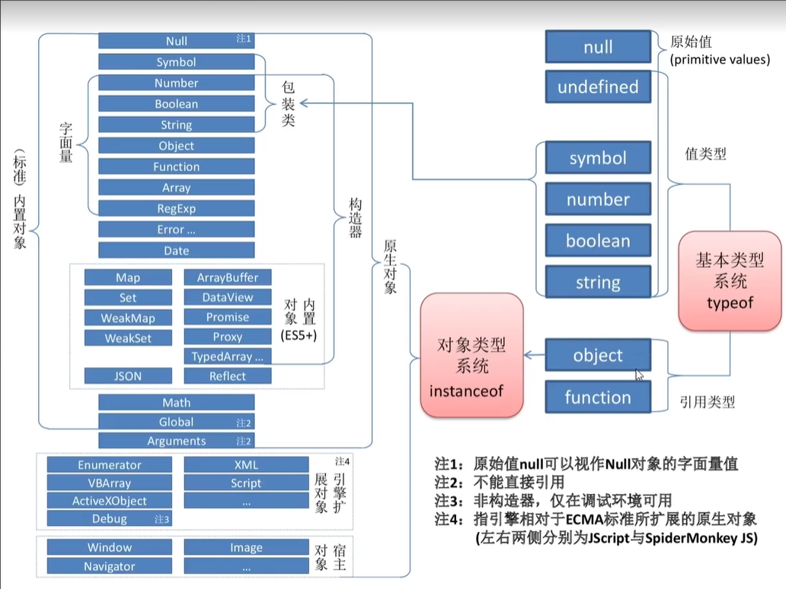

[TOC]

# TS与JS相关的那些类型

# JS中的类型

# TS中的类型

> JS中的值类型TS可以直接使用

常见类型

1. **基本类型**：
   - `number`：表示数字类型，包括整数和浮点数。
   - `string`：表示字符串类型。
   - `boolean`：表示布尔类型，即 `true` 或 `false`。
   - `null`：表示空值。
   - `undefined`：表示未定义值。
   - `void`：表示没有任何返回值的类型。
   - `symbol`：表示符号类型。
2. **复合类型**：
   - `array`：表示数组类型。
   - `tuple`：表示元组类型，即固定长度和类型的数组。
   - `enum`：表示枚举类型，即一组具名的常数集合。
   - `object`：表示对象类型。
3. **特殊类型**：
   - `any`：表示任意类型，允许变量存储任何类型的值。
   - `never`：表示永远不会返回值的类型，通常用于抛出异常或无限循环等场景。
   - `unknown`：表示未知类型，类似于 `any`，但更安全，需要进行类型检查或类型断言后才能使用。
4. **自定义类型**：
   - `interface`：表示接口类型，用于描述对象的形状。
   - `type`：表示类型别名，用于给类型起一个新的名字，通常用于复杂类型的定义。
5. **函数类型**：
   - `(parameters) => returnType`：表示函数类型，包括参数和返回值的类型。

特殊类型

1. **交叉类型**
2. **联合类型**
3. **字面类型**
